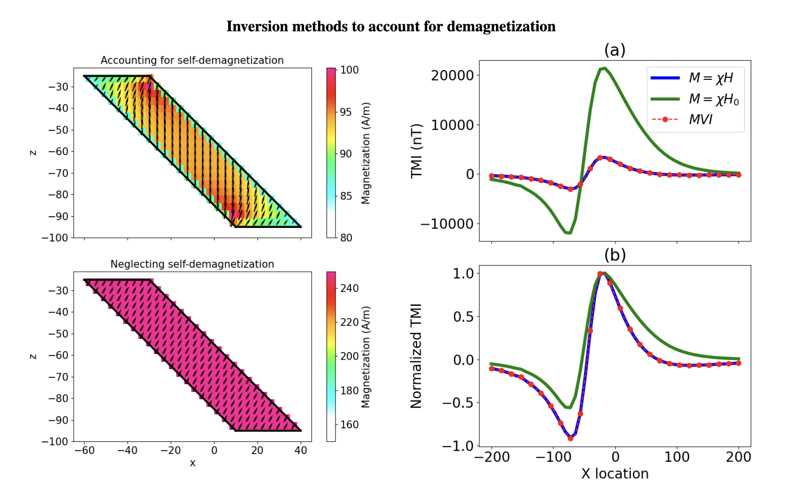

# Comparison of magnetic vector inversion with sparse norm susceptibility inversion accounting for demagnetization

_John M. Weis, Lindsey J. Heagy and Douglas W. Oldenburg_

## Summary 

Self-demagnetization effects complicate the interpretation of magnetic data for highly susceptible targets by altering both the magnitude and direction of the resultant total magnetization. While magnetic vector inversion (MVI) can model selfdemagnetization effects, the number of model parameters is tripled as compared to isotropic susceptibility inversion, increasing the non-uniqueness of the inverse problem. We show that if appropriate prior information is available, modeling demagnetization in terms of susceptibility can improve recovered models. We apply sparse inversion with bound constraints to adequately simulate self-demagnetization effects, and compare results with compact MVI on a synthetic model.

## Citation 

'''
John M. Weis, Lindsey J. Heagy, and Douglas W. Oldenburg, (2023), "Comparison of magnetic vector inversion with sparse norm susceptibility inversion accounting for demagnetization," SEG Technical Program Expanded Abstracts : 1141-1145.
https://doi.org/10.1190/image2023-3911157.1
'''